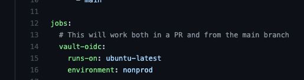

# github-oidc-vault-example

Example repo demonstrating access to Vault secrets through GitHub OIDC auth.
Configure GitHub OIDC authentication to Vault through my Terraform module - [`digitalocean/github-oidc/vault`](https://github.com/digitalocean/terraform-vault-github-oidc).

For a proof of concept, create an Ubuntu 20.04 Droplet and follow [Hashicorp's instructions](https://learn.hashicorp.com/tutorials/vault/getting-started-install) to apt install `vault`.

Also install [mkcert](https://github.com/FiloSottile/mkcert) to create a self-signed certificate for Vault, because `mkcert` makes it easy
and we should emphasize HTTPS in demos, even if self-signed.

In a command line on the server, run:

```bash
# Self-sign certificate for Vault
mkcert install
mkcert [public ip address] localhost 127.0.0.1 ::1
# Note the file names of the cert and key generated by mkcert!
# Set up a minimally-configured Vault server
# Update [mkcert filename] with the appropriate name from the output of the previous command
echo '
storage "file" {
  path = "/root/vault-data"
}

listener "tcp" {
  address = "0.0.0.0:443"
  tls_cert_file = "/root/[mkcert filename].pem"
  tls_key_file = "/root/[mkcert filename]-key.pem"
}

ui = true
disable_mlock = true
' > vault-config.hcl
vault server -config vault-config.hcl
# Proceed to https://<IP>/ and prepare unseal keys for Vault.
# Follow the UI prompts to unseal Vault.
#
# Open up a second terminal on the Vault server and run the rest:
export VAULT_ADDR='https://0.0.0.0:443'
vault login [root token from unsealing vault]
# I like to see the audit log on stdout in the first terminal while having a file to refer back to if needed
# You will likely want log_raw=true while first configuring the JWT auth backend in your development environment for debugging convenience.
vault audit enable file file_path=stdout log_raw=true
vault audit enable -path="vault_audit_file" file file_path=/root/vault_audit.log
# Set up a secret and a test policy that will be used by our 2 roles
vault secrets enable -path=secret kv-v2
vault kv put secret/foo/bar fi=fofum
echo '
path "secret/data/foo/bar" {
    capabilities = ["list", "read"]
}
' > policy.hcl
vault policy write oidc-policy policy.hcl
```

Now run `make apply` from the [`digitalocean/github-oidc/vault` Terraform module](https://github.com/digitalocean/terraform-vault-github-oidc) to configure the OIDC auth backend and the example roles used in this repo.

Note that during a pull request, the prod job [fails to authenticate to Vault](https://github.com/artis3n/github-oidc-vault-example/actions/runs/1953263436).


This occurs because the bound subject in the [OIDC configuration](https://github.com/digitalocean/terraform-vault-github-oidc/blob/main/examples/simple-repo/main.tf) will only authenticate the `oidc-prod-test` role from the `main` branch (`refs/heads/main`).


In contrast, the nonprod job successfully reads its secret from Vault. Note that the value of the secret will be automatically redacted from any Action workflow logs, to the best of GitHub's ability.
You shouldn't rely on this redaction in every use, but it is a helpful convenience.


This succeeds because the nonprod `oidc-test` Vault role is bound to the `nonprod` GitHub Environment.


The nonprod job is granted the `nonprod` Environment through <https://github.com/artis3n/github-oidc-vault-example/blob/main/.github/workflows/vault.yml#L16>.



Environments can be restricted to certain branches, so an alternative to the `refs/heads/main` subject for the prod role would be to create a `prod` Environment, configure the `bound_subject` to `environment:prod`, and restrict the Environment to the `main` branch using GitHub's settings.


Observe that once a pull request is merged into `main`, both jobs [run successfully](https://github.com/artis3n/github-oidc-vault-example/actions/runs/1953265376).


